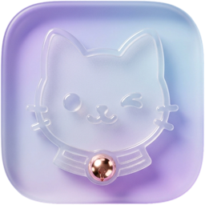

<p align="center">
  
</p>

<h1 align="center">CuteRecord</h1>


<p align="center">
<strong>可爱提词器与摄像头功能的口播录制工具</strong>
</p>

<p align="center">
  
  
  
</p>

---


## ✨ 产品简介

CuteRecord 是一款专为 macOS 打造的口播录制工具，集成专业提词器摄像头录制功能。支持多种比例口播视频录制。

## 🎯 产品优势

|传统录制痛点|CuteRecord 解决方案|
|---|---|
|录制时对照脚本朗读，操作别扭、画面不自然|适配刘海屏的一体化提词器，贴合摄像头下方布局，朗读视角更自然|

## 🚀 核心功能


### 📝 智能脚本编辑器

- 支持完整 Markdown 语法，自带代码高亮显示

### 🎭 多模式提词器

|模式|功能说明|
|---|---|
|刘海屏模式|灵动岛风格悬浮弹窗，贴合 MacBook 刘海区域展开，视觉极简|
|悬浮窗口模式|置顶可拖动悬浮窗，搭配磨砂玻璃特效，不遮挡核心画面|
|全屏模式|专属全屏提词界面，适配外接显示器，专注朗读录制|
|跟随光标模式|迷你提词面板，跟随鼠标光标移动，灵活适配操作场景|
|浏览器模式|任意设备打开网页即可使用，无需安装客户端，便捷远程提词|

### 🗣️ 智能语音追踪

- 实时字词追踪：依托本地语音识别技术，精准高亮当前朗读字词

- 经典自动滚动：可自定义滚动语速，实现平稳匀速翻页

- 语音触发控制：静默时自动暂停滚动，发声时自动续读，贴合朗读节奏

- 中英双语识别：内置 SherpaOnnx 双语语音模型，全程本地离线运行，无需联网

### 🎬 录制能力

- 摄像头录制：圆形悬浮摄像头窗口，支持自由拖动、缩放调整

- 录制预览：提前预览录制效果

- 支持导出：录制完成后支持自定义导出参数配置

### 🤖 AI 脚本优化

- AI 智能优化脚本，自动添加自然换气停顿、语速节奏标记，告别机械朗读感

- 兼容 30\+ 主流 AI 服务商，包含 302\.AI、DeepSeek、OpenAI 兼容接口等

- API 密钥存储于系统钥匙串，全程加密，安全不泄露

- 双模式导出：标记模式（带快速/慢速节奏标记）、纯净模式（仅换行排版）

### 🎬 导演远程控制模式

- 基于 WebSocket 协议实现双向远程控制，实时低延迟交互

- 支持导演/制作人通过浏览器远程实时修改、调整脚本内容

- 采用随机安全密钥验证，保障远程连接安全

- 可实时查看录制者朗读进度，精准把控录制节奏

### 🎨 高度自定义设置

- 人脸背景特效：内置猫眼注视，支持自定义图片，辅助矫正对视镜头视角

- 支持硬件提词设备镜像轴适配，兼容专业录制设备

- 录屏隐藏提词窗口，保护提词内容隐私，仅展示录制画面

### 🌐 双语适配

- 软件界面完整支持简体中文、英文双语切换

- 语音识别模型原生适配中英双语，精准识别混合朗读内容

## 🛠 技术架构

|技术层级|所用技术|
|---|---|
|界面开发|SwiftUI \+ AppKit 混合开发|
|语音识别|Apple 原生语音框架 \+ SherpaOnnx 离线双语 ASR 模型|
|录制核心|CGDisplayStream、AVAudioEngine、AVCaptureSession|
|网络通信|Network\.framework（TCP \+ WebSocket 协议）|
|AI 对接|兼容 OpenAI 接口的多服务商 AI 适配框架|
|数据存储|文件式加密存储 \+ 文件系统事件监控|
|并发处理|Swift 异步语法、Combine 响应式框架|

## 📦 安装部署

### 运行要求

- 系统版本：macOS 13（Ventura）及以上

- 编译环境：Xcode 15 及以上

### 源码编译步骤

```bash
git clone https://github.com/worth01/CuteRecord.git
cd CuteRecord
open CuteRecord.xcodeproj
```

**注意事项**：项目 Vendor 目录下的 SherpaOnnx 模型文件与动态库为占位文件，如需完整离线语音识别功能，需自行从 SherpaOnnx 官方项目下载完整二进制文件替换。

## ⌨️ 快捷键指南

|快捷键|对应功能|
|---|---|
|⌘B|显示/隐藏侧边栏|
|⌘⌥N|新建脚本页面|
|⌘⌥S|开始/停止录制|
|⌘⌥P|打开提词器窗口|
|⌘⌥D|开启语音听写模式|

## 📁 项目结构

```plain
CuteRecord/                         # 应用核心源码目录
├── AI/                             # AI脚本优化引擎与服务商适配目录
├── Recording/                      # 屏幕、音频、摄像头录制核心流程
│   ├── Core/                       # 音频、摄像头权限管理与录制引擎
│   ├── Models/                     # 录制状态、编辑记录、素材数据模型
│   └── UI/                         # 摄像头悬浮窗口、录制指示器、编辑界面
├── Setup/                          # 系统权限申请引导流程
├── Storage/                        # 项目数据加密存储与修复机制
├── Teleprompter/                   # 提词脚本分词、语音进度匹配核心逻辑
└── Fonts/                          # 内置开源护眼字体资源
Tests/RecordingCoreTests/           # 录制核心功能单元测试
Vendor/                             # 第三方依赖：ASR模型、动态库、框架文件
```

## 📄 开源协议

CuteRecord 基于 **Apache License 2\.0** 协议开源发布。

## 👨‍💻 开发作者

worth01

## 🙏 致谢

本项目基于 Nolan Lai 开发的 CueRecord 迭代优化而来，感谢原作者提供的优质项目基础。

---

<div align="center">
  
**本工具希望能为口播视频做得更多。**

*如果你觉得有用，点一个 ⭐ Star 是对我最大的鼓励！*

 

</div>
