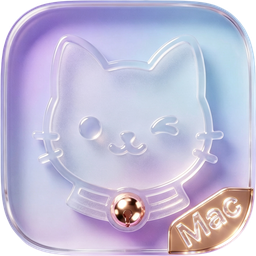

<p align="center">
  
</p>

<h1 align="center">CuteRecord</h1>

<p align="center">
  <strong>专为口播视频录制打造的可爱风提词器</strong><br>
  写稿 → 提词 → 录制 → 导出 一气呵成
</p>

<p align="center">
  
  
  
  
</p>

---

## ✨ 为什么选 CuteRecord

你不需要同时打开提词器 App + 相机工具 + 语音识别。CuteRecord 把**写稿、提词、录制、导出**整合成一个流畅的工作流，加入离线 AI 语音识别和 iPhone 联动，一人搞定专业口播。

| 痛点 | CuteRecord 怎么解决 |
|---|---|
| 📝 对着镜头忘词 | **灵动岛 / 悬浮窗 / 全屏** 三种提词器模式 |
| 🤖 提词器跟不上语速 | **离线 AI 语音追踪** — 说到哪里亮到哪里，不需要联网 |
| 🎬 提词器 + 录制要开两个软件 | **一键录制** — 摄像头 + 声音一次搞定 |
| 📱 用 iPhone 当摄像头？没有联动的软件 | **手机录制模式** — Mac 远程控制 iPhone 录制，脚本自动推送 |
| 📜 好用的脚本找不到了 | **脚本历史** — 每次录制自动保存，随时找回 |
| 🎀 工具太严肃，没有美感 | **粉色主题 + 猫猫吉祥物** — 录制也可以很可爱 |

---

## 🎯 核心功能

### 📝 脚本编辑器
- Markdown 编辑器，支持拖入 PPTX 自动提取备注
- **AI 断句** — 支持 DeepSeek 等模型，填 Key 即用
- **脚本历史** — 编辑 / 历史双标签，每次录制自动保存，最多 10 条，点击即用
- 语音转文字输入
- 字数统计 + 阅读时长预估

### 🎭 三种提词器模式

| 模式 | 适用场景 |
|---|---|
| **灵动岛** | 日常录制，固定屏幕顶部，不占空间 |
| **悬浮窗** | 任意拖拽、始终置顶、跟随鼠标 |
| **全屏** | 外接显示器 / Sidecar iPad，专业提词器体验 |

### 🗣️ 离线语音追踪（无需联网）

- **逐词高亮** — 说到哪里亮到哪里
- **经典滚动** — 匀速自动滚
- **语音触发** — 说话时滚动，沉默时暂停
- 基于 **SherpaOnnx** 端侧模型，中英双语识别，**完全离线**，数据不上传

### 🎬 两种录制模式

**MAC 录制** — 使用 Mac 自带摄像头
- 摄像头画中画，可拖拽调整大小
- 猫爪录制按钮，3-2-1 倒计时
- 粉色可爱主题

**手机录制** — iPhone 当高清摄像头
- Mac 一键推脚本到手机
- 远程控制录制启停
- 手机前置/后置摄像头切换
- 手机停止录制 → Mac 自动同步停止

### 🎨 可爱风设计
- 🎀 粉色主题
- 🐱 猫爪录制按钮 + 倒计时
- 🔊 声音反馈
- 全部弹窗统一 iOS 可爱风（毛玻璃 + 圆角 + 柔和投影）

### 🌐 国际化
- 中英双语界面

---

## ⌨️ 快捷键

| 快捷键 | 功能 |
|---|---|
| `⌘O` | 打开文件夹 |
| `⌘,` | 设置 |
| `⌘⌥N` | 新建页面 |
| `⌘⌥S` | 开始/停止录制 |
| `⌘⌥P` | 打开提词器 |
| `⌘⌥D` | 语音转文字 |

---

## 📦 安装

### 系统要求
- **macOS 13 (Ventura)** 或更高版本
- Apple Silicon 或 Intel Mac

### 直接安装
1. 从 [Releases](https://github.com/worth1/CuteRecord/releases) 下载 `CuteRecord-Mac-v*.zip`
2. 解压后拖入 `/Applications`
3. 首次打开：右键 → 打开（绕过 Gatekeeper）

### 从源码构建
```bash
git clone https://github.com/worth1/CuteRecord.git
cd CuteRecord
open CuteRecord.xcodeproj
```

> 离线语音识别需要 SherpaOnnx 模型和 dylib。运行 `scripts/setup_sherpa_onnx.sh` 自动下载，或从 [SherpaOnnx Releases](https://github.com/k2-fsa/sherpa-onnx/releases) 手动下载并放入 `Vendor/` 目录。

---

## 🏗 项目结构

```text
CuteRecord/
├── AI/                    AI 脚本断句 & 提供商
├── Recording/             录制管线
│   ├── Core/              录制引擎、权限、摄像头管理、音频管理
│   ├── Models/            录制状态 & 编辑决策
│   └── UI/                摄像头画中画、预览栏、编辑器、停止栏
├── Setup/                 权限请求面板（CutePanel 风格）
├── Storage/               工作区项目管理
├── Teleprompter/          提词器视图 & 语音匹配
├── Resources/             猫猫图片 & 音效
└── Vendor/                SherpaOnnx 模型 & 动态库
```

---

## 📄 开源协议

[Apache License 2.0](LICENSE)

---

<p align="center">
  <sub>可爱地录制，自信地表达</sub>
</p>
